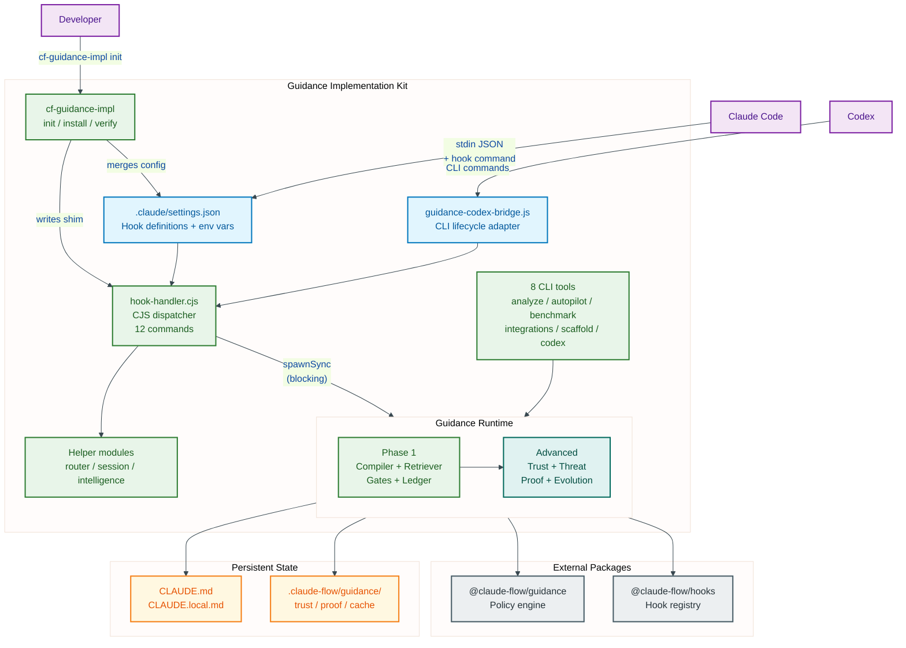
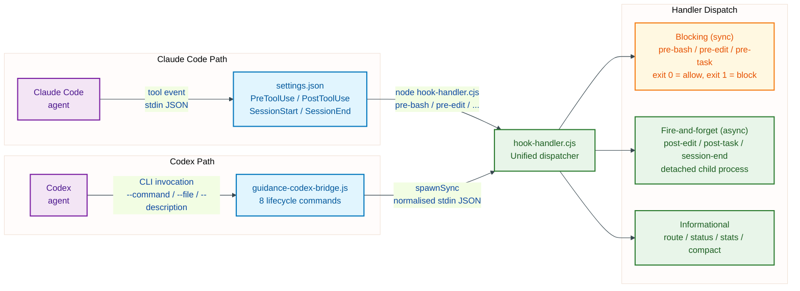
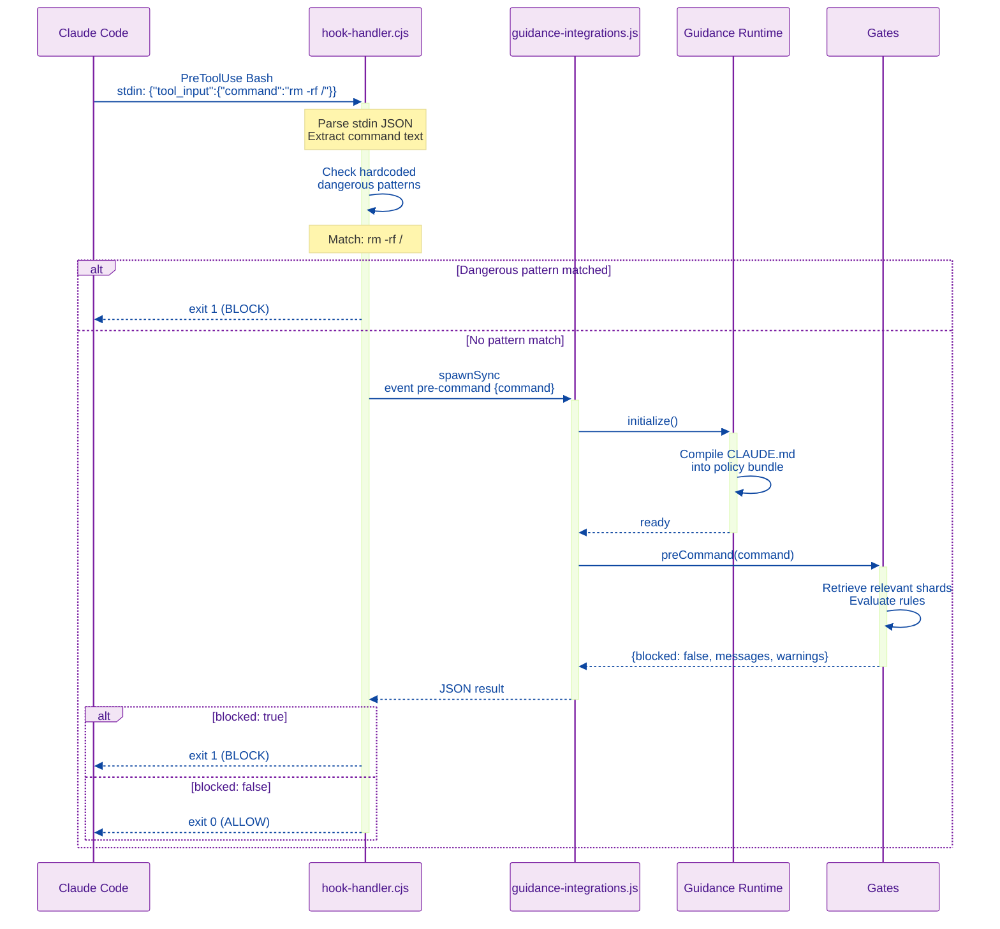
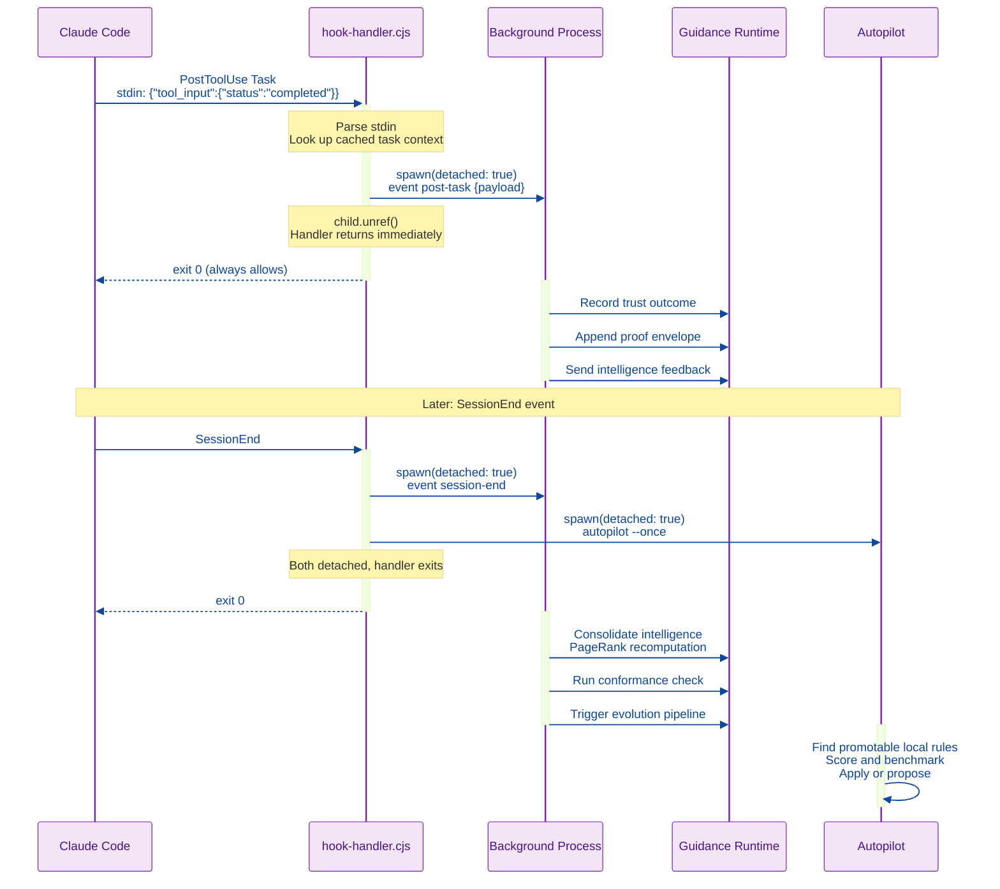
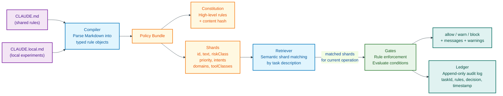
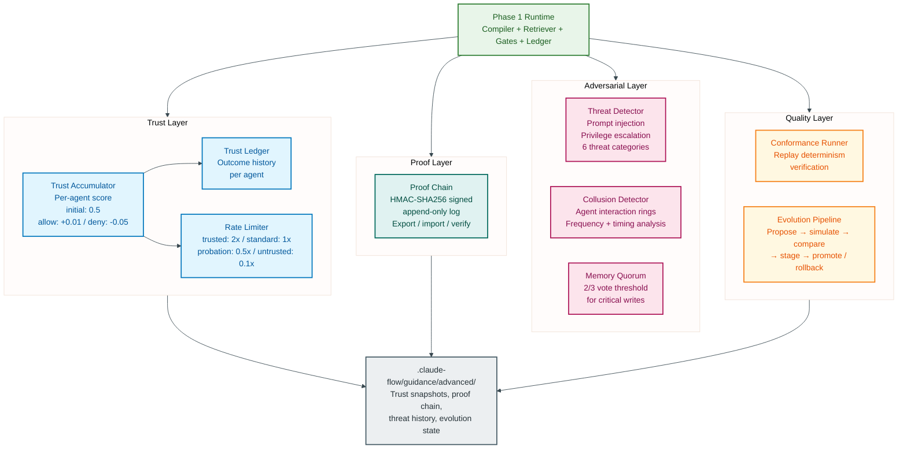
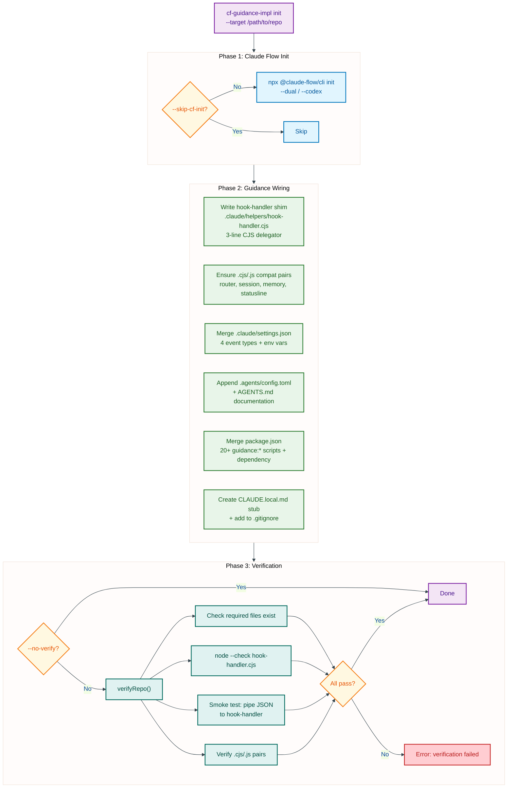
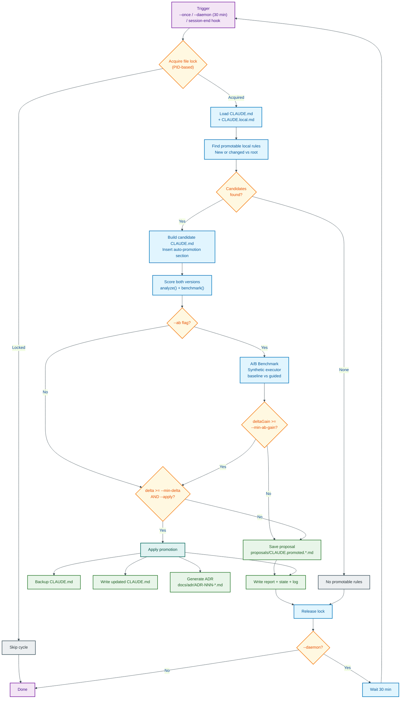

# Solutions Architecture: claude-flow-guidance-implementation

## 1. Executive Summary

The Guidance Implementation Kit is a turnkey integration layer that enforces `CLAUDE.md` policy rules on every tool use by AI coding agents. It sits between the agent runtime (Claude Code or OpenAI Codex) and the `@claude-flow/guidance` policy engine. When an agent is about to execute a command, edit a file, or spawn a task, the kit intercepts the event, evaluates it against compiled policy rules, and returns an allow or block decision within the agent's hook timeout window.

The kit provides: a one-command installer (`cf-guidance-impl init`) that wires hooks into any repository; a CommonJS hook dispatcher that handles 12 lifecycle events; a two-tier policy runtime (lightweight gates plus enterprise security layers); and continuous policy optimisation via an autopilot that promotes high-performing local rules with full scoring and A/B benchmarking.

---

## 2. Solution Architecture

This diagram shows the complete system: agents on the left, the kit's processing layers in the centre, and external dependencies on the right.

Mermaid source

---

## 3. Integration Architecture

The kit supports two integration paths. Claude Code has a native hook system; Codex does not. The bridge adapter normalises Codex events into the same format so both agents share identical policy enforcement.

Mermaid source

### Hook Event Mapping

| Claude Code Hook | Handler Command | Guidance Event | Sync | Can Block |
|---|---|---|---|---|
| `PreToolUse` Bash | `pre-bash` | `pre-command` | Yes | Yes |
| `PreToolUse` Write/Edit/MultiEdit | `pre-edit` | `pre-edit` | Yes | Yes |
| `PreToolUse` Task | `pre-task` | `pre-task` | Yes | Yes |
| `PostToolUse` Write/Edit/MultiEdit | `post-edit` | `post-edit` | No | No |
| `PostToolUse` Task | `post-task` | `post-task` | No | No |
| `SessionStart` | `session-restore` | session init | No | No |
| `SessionEnd` | `session-end` | session persist | No | No |

---

## 4. Request Flow: Blocking Hooks

When Claude Code is about to execute a tool, it fires a `PreToolUse` event. The hook handler must return before the agent proceeds. Exit code 0 allows the operation; exit code 1 blocks it.

Mermaid source

The three blocking hooks (`pre-bash`, `pre-edit`, `pre-task`) all follow this pattern. Two layers of defence apply:

1. **Hardcoded patterns** (hook handler) — regex checks for `rm -rf /`, `format c:`, `del /s /q c:\`, and fork bombs. Fast, zero-dependency, always-on.
2. **Policy gates** (guidance runtime) — compiled CLAUDE.md rules evaluated against the specific operation. Configurable, auditable, evolvable.

Timeout behaviour is configurable: `GUIDANCE_EVENT_SYNC_TIMEOUT_MS` (default 8000ms) controls how long the handler waits for the guidance runtime. `GUIDANCE_EVENT_FAIL_CLOSED=0` (default) means a timeout allows the operation rather than blocking it.

---

## 5. Request Flow: Async Hooks

Post-event hooks must not slow down the agent. They spawn detached child processes and return immediately.

Mermaid source

---

## 6. Policy Compilation Pipeline

All policy rules originate from Markdown files. The compiler transforms them into structured, enforceable gates.

Mermaid source

### Policy sources

- **`CLAUDE.md`** — shared rules checked into the repository. Visible to all contributors. Contains the project's authoritative behavioural policy.
- **`CLAUDE.local.md`** — local-only experiments (gitignored). Developers test rule changes here before promoting them via the autopilot.

### Shard properties

Each compiled shard carries metadata used for matching and enforcement:

| Property | Example | Purpose |
|---|---|---|
| `riskClass` | `high` | Determines gate strictness |
| `priority` | `90` | Ordering when multiple rules match |
| `intents` | `#security, #implementation` | Semantic matching to task context |
| `domains` | `@engineering` | Scope limitation |
| `toolClasses` | `[bash], [edit]` | Tool-specific rule application |

---

## 7. Security Architecture

The Advanced Runtime layers four security capabilities on top of the Phase 1 policy pipeline.

Mermaid source

### Trust tiers

| Tier | Score Range | Rate Multiplier | Meaning |
|---|---|---|---|
| Trusted | >= 0.8 | 2.0x | Consistently follows policy |
| Standard | >= 0.5 | 1.0x | Normal operation |
| Probation | >= 0.3 | 0.5x | Recent violations |
| Untrusted | < 0.3 | 0.1x | Repeated violations, heavily throttled |

### Threat categories

The threat detector analyses inputs against 6 categories: prompt injection, memory poisoning, shard manipulation, malicious delegation, privilege escalation, and data exfiltration. Severe threats (score >= 0.85) trigger an immediate block independent of gate results.

### Proof chain

Every significant operation produces an HMAC-SHA256 signed envelope containing: the event details, tool call records, memory operations, agent ID, detected violations, and the previous envelope's hash. The chain is verifiable end-to-end and exportable for external audit.

---

## 8. Installer and Deployment

The installer (`cf-guidance-impl init`) wires hooks into any target repository in three phases.

Mermaid source

### What gets installed

| File | Purpose |
|---|---|
| `.claude/helpers/hook-handler.cjs` | 3-line shim that `require()`s the full handler from `node_modules` |
| `.claude/settings.json` (merged) | Hook definitions for PreToolUse, PostToolUse, SessionStart, SessionEnd |
| `package.json` (merged) | 20+ `guidance:*` npm scripts + implementation dependency |
| `.agents/config.toml` (Codex mode) | Bridge command mapping |
| `CLAUDE.local.md` | Stub for local rule experiments |

The thin shim architecture means the hook-handler logic lives in `node_modules` and updates automatically via `npm update` without re-running the installer.

---

## 9. Autopilot Optimisation

The autopilot continuously improves `CLAUDE.md` by promoting high-performing rules from `CLAUDE.local.md`.

Mermaid source

### Autopilot triggers

| Trigger | Mode | Description |
|---|---|---|
| `session-end` hook | Automatic | Spawned as detached background process at end of every Claude Code session |
| `--once` | Manual | Single optimisation cycle via `npm run guidance:autopilot:once` |
| `--daemon` | Continuous | Repeating cycle every 30 minutes via `npm run guidance:autopilot:daemon` |

### Environment controls

| Variable | Default | Purpose |
|---|---|---|
| `GUIDANCE_AUTOPILOT_ENABLED` | `1` | Disable with `0` to suppress session-end autopilot |
| `GUIDANCE_AUTOPILOT_MIN_DELTA` | `0.5` | Minimum score improvement for promotion |
| `GUIDANCE_AUTOPILOT_AB` | `0` | Enable A/B gate with `1` |
| `GUIDANCE_AUTOPILOT_MIN_AB_GAIN` | `0.05` | Minimum A/B delta gain |

---

## 10. Key Design Decisions

### ADR-001: CommonJS for the hook handler

**Context**: Claude Code executes hooks by running `node <path>`. The handler is in the critical path of every tool use.

**Decision**: Use CommonJS (`.cjs`) with lazy `require()` loading, not ESM.

**Rationale**: CJS avoids ESM resolution overhead and supports synchronous `require()` calls that only load modules when actually needed. Helper modules (router, session, intelligence) are loaded on first use, not at startup.

### ADR-002: Synchronous guidance calls for blocking hooks

**Context**: Pre-bash, pre-edit, and pre-task handlers must return a decision before the agent proceeds.

**Decision**: Use `spawnSync` to invoke the guidance runtime as a child process.

**Rationale**: Claude Code expects the hook process to exit before continuing. The exit code determines allow/block. Timeout and fail-open/fail-closed behaviour are configurable.

### ADR-003: Detached async processes for post-hooks

**Context**: Post-edit, post-task, and session-end perform governance work (trust recording, proof chain, intelligence consolidation) that should not delay the agent.

**Decision**: Use `spawn` with `detached: true` and `child.unref()`.

**Rationale**: The handler process exits immediately. The background process runs independently, persisting state without blocking agent execution.

### ADR-004: Thin shim architecture

**Context**: The installer writes a hook-handler file into the target repository.

**Decision**: Write a 3-line CJS shim that `require()`s the full handler from `node_modules`, rather than copying the full handler source.

**Rationale**: Updates to handler logic are picked up automatically via `npm update`. No need to re-run the installer after package updates.

### ADR-005: Dual module system support

**Context**: The hook handler must be CJS (for startup speed); CLI tools and runtime use ESM (for modern syntax and tree-shaking).

**Decision**: Maintain both `.mjs` (ESM) and `.cjs` (CJS) variants of shared utilities. The installer creates `.js`/`.cjs` compatibility pairs for all helper modules.

**Rationale**: Both module systems are required and cannot be avoided. The compatibility pair mechanism ensures `require()` and `import` both resolve to the same logic.

### ADR-006: Fail-open by default

**Context**: If the guidance runtime times out or crashes during a blocking hook, the agent is stuck.

**Decision**: Default to fail-open (`GUIDANCE_EVENT_FAIL_CLOSED=0`). The agent proceeds if guidance is unavailable.

**Rationale**: An unresponsive guidance system should degrade gracefully rather than halt all agent operations. Operators can set `GUIDANCE_EVENT_FAIL_CLOSED=1` for high-security environments.

---

## 11. Module Map

| Layer | File | Role |
|---|---|---|
| **Entry** | `bin/cf-guidance-impl.mjs` | CLI entry point for installer |
| **Installer** | `src/installer.mjs` | `initRepo()`, `installIntoRepo()`, `verifyRepo()` |
| **Config** | `src/default-settings.mjs` | Hook definitions, env vars, npm scripts, dependency declarations |
| **Dispatcher** | `src/hook-handler.cjs` | CJS hook handler: 12 commands, stdin JSON parsing, dispatch |
| **Utilities** | `src/utils.mjs` / `src/utils.cjs` | Shared helpers (ESM + CJS variants) |
| **Runtime** | `src/guidance/phase1-runtime.js` | Compiler + Retriever + Gates + Ledger + Hook Registry |
| **Runtime** | `src/guidance/advanced-runtime.js` | Trust + Adversarial + Proof + Conformance + Evolution |
| **Runtime** | `src/guidance/integration-runners.js` | 6 integration test suites |
| **Runtime** | `src/guidance/content-aware-executor.js` | Synthetic executor for A/B benchmarking |
| **CLI** | `src/cli/guidance-integrations.js` | Event dispatch + integration suite orchestration |
| **CLI** | `src/cli/event-handlers.js` | Per-event policy enforcement logic |
| **CLI** | `src/cli/guidance-autopilot.js` | Rule optimisation and promotion |
| **CLI** | `src/cli/guidance-ab-benchmark.js` | A/B benchmark runner |
| **CLI** | `src/cli/analyze-guidance.js` | Policy bundle scoring (6 dimensions) |
| **CLI** | `src/cli/guidance-runtime.js` | Runtime demo and interactive testing |
| **CLI** | `src/cli/guidance-codex-bridge.js` | Codex lifecycle adapter (8 events) |
| **CLI** | `src/cli/scaffold-guidance.js` | Project scaffolding generator |

### External dependencies

| Package | Purpose |
|---|---|
| `@claude-flow/guidance` | Policy engine: compiler, retriever, gates, ledger, trust, adversarial, proof, conformance, evolution, analyzer |
| `@claude-flow/hooks` | Hook registry and executor framework |
