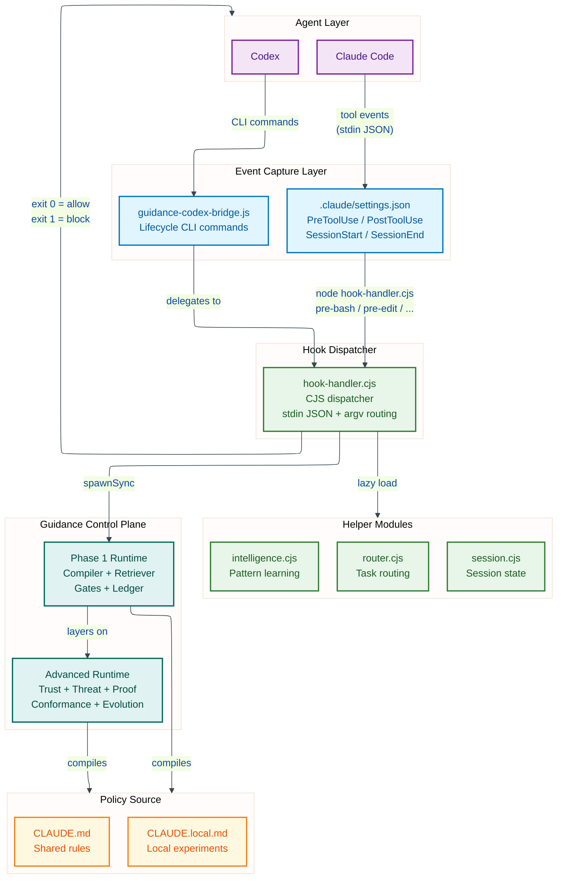
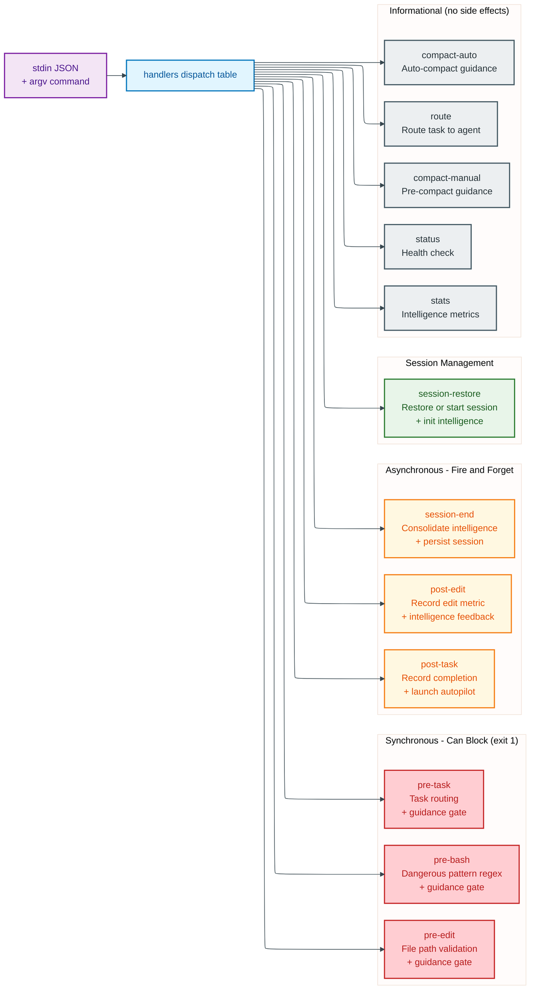
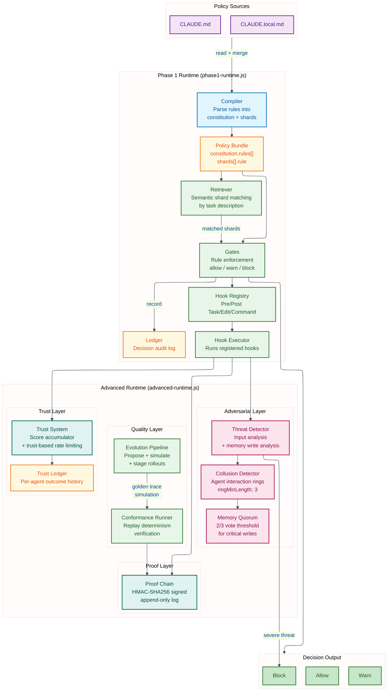
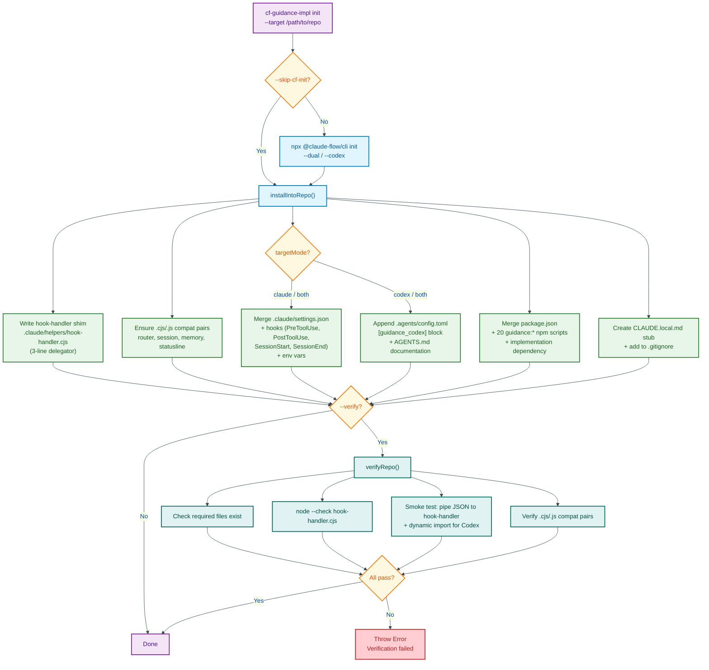
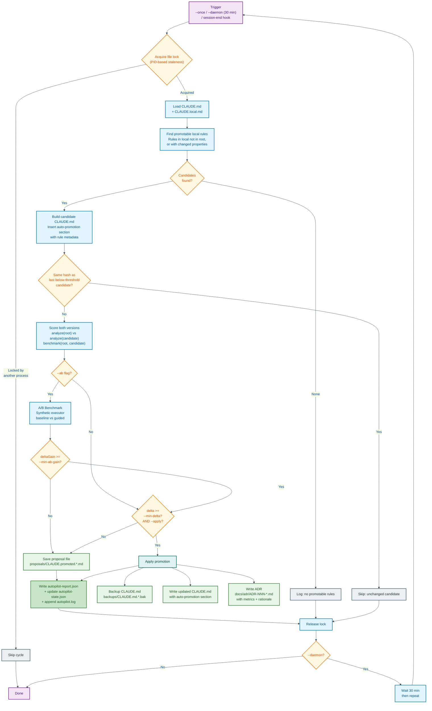
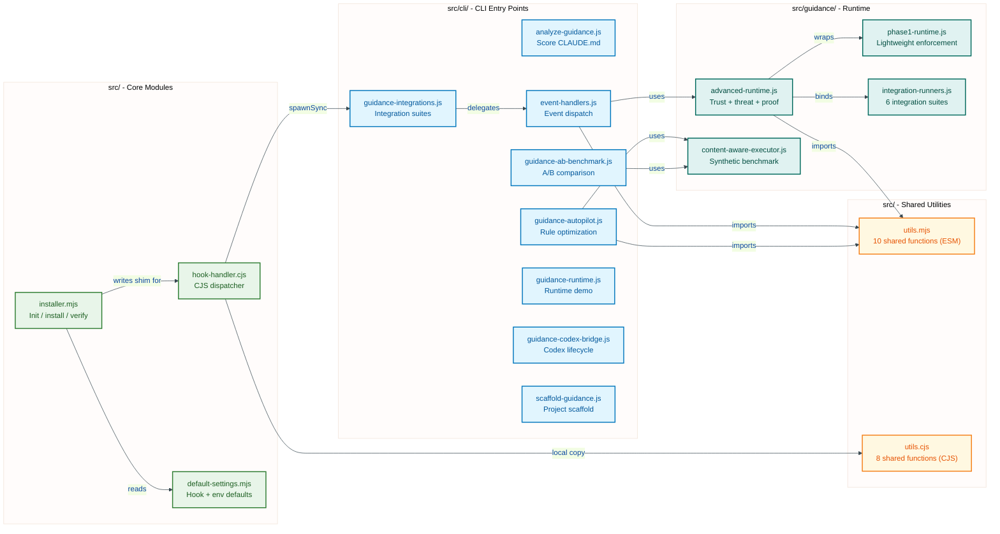

# Architecture: claude-flow-guidance-implementation

This document explains how the guidance implementation kit works, from the moment a Claude Code or Codex agent triggers a lifecycle event through to the policy enforcement decision and back. It covers the system architecture, the hook-handler dispatch mechanism, the two-tier guidance control plane, the installer workflow, and the autopilot optimization loop.

---

## 1. System Architecture Overview

The guidance implementation kit sits between two AI coding agents (Claude Code and OpenAI Codex) and the `@claude-flow/guidance` control plane. Its job is to intercept every tool use, command execution, file edit, and task lifecycle event, run it through a policy engine compiled from `CLAUDE.md`, and return an allow/warn/block decision before the agent proceeds.

### How Events Flow

**Claude Code** exposes a native hook system via `.claude/settings.json`. When Claude Code is about to execute a tool (Write, Edit, Bash, Task), it fires a `PreToolUse` event. The settings file maps each tool pattern to a shell command that runs `hook-handler.cjs` with the appropriate subcommand. Claude Code passes the tool input as JSON on stdin. The hook-handler reads this JSON, extracts the relevant fields (command text, file path, task description), and decides whether to allow or block by its exit code: `exit 0` allows the operation, `exit 1` blocks it.

**Codex** does not have native event hooks. Instead, the kit provides `guidance-codex-bridge.js`, a CLI wrapper that Codex can invoke at each lifecycle point. The bridge constructs the same stdin JSON format that Claude Code provides, spawns the hook-handler as a child process, and forwards the exit code. This gives Codex repos identical policy enforcement without requiring Claude Code's hook system.

### The Three Layers

1. **Event Capture Layer** — `.claude/settings.json` (Claude Code) and `guidance-codex-bridge.js` (Codex) capture lifecycle events and normalize them into a common format.

2. **Hook Dispatcher** — `hook-handler.cjs` is a CommonJS module that receives the normalized event, dispatches it to the appropriate handler function, and optionally delegates to helper modules (router, session, intelligence) for task routing, session state tracking, and pattern learning.

3. **Guidance Control Plane** — The Phase 1 runtime compiles `CLAUDE.md` into a policy bundle (constitution rules + shards), retrieves relevant shards for the current operation, evaluates them through gates, and records decisions in a ledger. The Advanced runtime layers on trust scoring, adversarial threat detection, cryptographic proof chains, conformance testing, and rule evolution.

### Policy Sources

All policy rules originate from two Markdown files:

- **`CLAUDE.md`** — shared rules checked into the repository, visible to all contributors
- **`CLAUDE.local.md`** — local-only experiments (gitignored), used for testing rule changes before promotion

The compiler parses these files into structured rule objects with properties like risk class, priority, intents, domains, and tool classes.

Mermaid Source

---

## 2. Hook-Handler Dispatch Flow

The hook-handler (`src/hook-handler.cjs`) is the central routing point for all lifecycle events. It is a CommonJS module (required by Claude Code's hook runner, which uses `node` to execute it) that reads JSON from stdin and a command name from argv, then dispatches to one of 12 handler functions.

### Command Categories

The 12 commands fall into four categories based on their behavior:

**Synchronous — Can Block (exit 1)**

These three commands run before the agent acts. If guidance policy or safety patterns reject the operation, the handler calls `process.exit(1)` and Claude Code aborts the tool call.

- **`pre-bash`** — Runs before every Bash command. First, it sends the command text to the guidance control plane's `pre-command` event, which evaluates it against compiled policy rules. If the control plane returns `blocked: true`, the command is rejected. As a second layer, the handler checks the command against four hardcoded dangerous patterns (`rm -rf /`, `format c:`, `del /s /q c:\`, and fork bombs). Either check can block the command.

- **`pre-edit`** — Runs before every Write, Edit, or MultiEdit tool call. Sends the file path, content, diff line count, and operation type to the guidance control plane's `pre-edit` event. The gates evaluate whether the edit violates any policy rules (e.g., editing protected files, writing secrets).

- **`pre-task`** — Runs before every Task tool call (agent spawning). Sends the task description to the guidance control plane and also to the local router module for agent recommendation. The handler remembers the task ID and description in a file cache (`hook-task-cache.json`) so that the matching `post-task` can correlate the completion.

**Asynchronous — Fire and Forget**

These commands run after the agent has already acted. They spawn detached child processes and return immediately so they don't slow down the agent.

- **`post-edit`** — Records an edit metric in the session state and sends an intelligence feedback signal. Launches the guidance `post-edit` event asynchronously.

- **`post-task`** — Records task completion. Retrieves the remembered task context from the cache, sends the `post-task` event to guidance asynchronously, and provides intelligence feedback.

- **`session-end`** — Consolidates the intelligence module's learned patterns (PageRank recomputation over the pattern graph), ends the session, launches the guidance `session-end` event, and fires the autopilot optimizer as a detached background process.

**Session Management**

- **`session-restore`** — Called at `SessionStart`. Restores or starts a session via the session helper. Initializes the intelligence module, loading patterns and edges from the pattern graph. Reports the loaded pattern count.

**Informational (No Side Effects)**

- **`route`** — Returns an agent recommendation for a given task prompt without blocking anything. Uses the router module's keyword matching and confidence scoring.
- **`compact-manual`** / **`compact-auto`** — Print guidance context reminders before Claude Code's context compaction. These ensure the agent retains awareness of CLAUDE.md rules after its context window is compressed.
- **`status`** — Health check (always returns OK).
- **`stats`** — Prints intelligence module metrics (pattern counts, learning stats).

### The Guidance Event Protocol

For the three blocking commands, the handler uses `spawnSync` to call `guidance-integrations.js event <eventName> <jsonPayload>`. This synchronous call ensures the hook-handler waits for the policy decision before returning its exit code. The guidance integrations script initializes the Advanced runtime, runs the appropriate Phase 1 gate, performs threat detection (for `pre-command`), records trust outcomes, appends a proof chain entry, and returns a JSON result with `blocked: true/false`.

For async commands, the handler uses `spawn` with `detached: true` and `stdio: 'ignore'`, then calls `child.unref()` so the child process outlives the handler.

Mermaid Source

---

## 3. Guidance Control Plane Internals

The guidance control plane is the policy engine at the heart of this system. It has two tiers: a lightweight **Phase 1 runtime** for basic policy enforcement, and an **Advanced runtime** that layers security, trust, and governance features on top.

### Phase 1 Runtime (`phase1-runtime.js`)

The Phase 1 runtime uses four core components from the `@claude-flow/guidance` package:

1. **Compiler** — Takes the raw text of `CLAUDE.md` and optionally `CLAUDE.local.md`, parses them into structured rules, and produces a **policy bundle**. The bundle contains two parts:
   - A **constitution** — the set of high-level rules (e.g., "NEVER commit secrets", "ALWAYS run lint after changes") with a content hash for integrity checking.
   - **Shards** — individual rule objects with metadata: `id`, `text`, `riskClass` (low/medium/high/critical), `priority` (numeric), `intents` (e.g., #implementation, #security), `domains` (e.g., @engineering), and `toolClasses` (e.g., [bash], [edit]).

2. **Retriever** — Given a task description, performs semantic shard matching to find the most relevant policy rules. For example, a task description mentioning "authentication" would retrieve shards tagged with #security or @auth domains. The retriever returns matched shards with similarity scores.

3. **Gates** — The enforcement engine. Gates evaluate the retrieved rules against the current operation and produce an **allow**, **warn**, or **block** decision. A gate decision includes messages (human-readable explanations) and warnings. If any gate blocks, the overall result is `aborted: true`.

4. **Ledger** — An append-only audit log of every gate decision. Records the task ID, the rules evaluated, the decision, and a timestamp. Used for conformance testing and debugging.

Additionally, the Phase 1 runtime uses the `@claude-flow/hooks` package to register hook handlers into a **Hook Registry** and execute them through a **Hook Executor**. The `createGuidanceHooks()` function wires the gates, retriever, and ledger into the hook lifecycle so that every `PreTask`, `PreCommand`, `PreEdit`, and `PostTask` event automatically goes through the compile-retrieve-gate-record pipeline.

### Advanced Runtime (`advanced-runtime.js`)

The Advanced runtime wraps the Phase 1 runtime and adds four security/governance layers:

**Trust Layer**

The trust system maintains a per-agent score that changes based on gate outcomes. Every allow, warn, or deny decision adjusts the agent's trust score through an accumulator. The trust ledger records the full history of outcomes per agent. Trust scores affect rate limiting — agents with lower trust get stricter rate limits (e.g., a trust score of 0.5 might halve the allowed operations per minute). Trust snapshots are persisted to disk between sessions.

**Adversarial Layer**

Three detectors work together to identify malicious or compromised agent behavior:

- **Threat Detector** — Analyzes command inputs for prompt injection patterns (e.g., "ignore all previous instructions") and memory write operations for privilege escalation attempts (e.g., writing `admin=true` to a `user-role` key). Returns threat signals with severity scores.

- **Collusion Detector** — Tracks interaction patterns between agents. If three or more agents form a communication ring with frequency above a threshold (`ringMinLength: 3`, `frequencyThreshold: 5`), it flags potential collusion. This catches scenarios where compromised agents coordinate to bypass policy.

- **Memory Quorum** — Requires a 2/3 vote from validator agents before critical memory writes are accepted. A proposer submits a write, validators vote, and the quorum resolves when the threshold is met. This prevents a single compromised agent from corrupting shared state.

**Proof Layer**

An HMAC-SHA256 signed, append-only proof chain records every significant operation. Each entry (envelope) contains: the event details, tool call records, memory operations, the agent ID, violations detected, and the previous entry's hash (forming a chain). The chain can be exported, imported, and verified end-to-end. Tampering with any entry invalidates the chain from that point forward. The signing key is configured via `GUIDANCE_PROOF_KEY` (falls back to an insecure dev key with a warning).

**Quality Layer**

- **Conformance Runner** — Replays a sequence of operations through the policy engine and verifies that the decisions are deterministic. If replaying the same trace produces different results, it flags a conformance failure. This catches non-determinism in the policy evaluation pipeline.

- **Evolution Pipeline** — Manages the lifecycle of policy changes. A proposed rule change goes through: propose (create the change), simulate (replay golden traces with the candidate config), compare (check if metrics improve), and stage (graduated rollout with configurable stages). Each stage monitors divergence and success rates before advancing.

Mermaid Source

---

## 4. Installer Workflow

The installer (`src/installer.mjs`) provides three exported functions: `initRepo`, `installIntoRepo`, and `verifyRepo`. The CLI binary `cf-guidance-impl` exposes these as `init`, `install`, and `verify` subcommands.

### What `cf-guidance-impl init` Does

The `init` command performs a complete setup of guidance wiring in a target repository. It runs in three phases:

**Phase 1: Claude Flow Initialization (optional)**

Unless `--skip-cf-init` is passed, the installer runs `npx @claude-flow/cli init` in the target repo. The `--dual` flag (default for `both` mode) initializes both Claude Code and Codex support. This sets up the base Claude Flow configuration files.

**Phase 2: Guidance Wiring (`installIntoRepo`)**

This is the core of the installer. It performs six operations:

1. **Write hook-handler shim** — Creates `.claude/helpers/hook-handler.cjs` in the target repo. This is a 3-line file that sets `__GUIDANCE_HELPERS_DIR` to the local helpers directory and then `require()`s the full hook-handler from the npm package. This indirection lets Claude Code's settings reference a local file path while the actual logic lives in `node_modules`.

2. **Ensure `.cjs`/`.js` compatibility pairs** — The hook-handler uses `require()` (CommonJS), but some helper modules may only exist as `.js` or `.cjs`. The installer checks four modules (`router`, `session`, `memory`, `statusline`) and copies whichever extension exists to create the missing counterpart.

3. **Merge `.claude/settings.json`** — For Claude Code mode, the installer merges hook definitions into the settings file. It registers four event types:
   - `PreToolUse` with matchers for `Write|Edit|MultiEdit` (runs `pre-edit`), `Bash` (runs `pre-bash`), and `Task` (runs `pre-task`)
   - `PostToolUse` with matchers for `Write|Edit|MultiEdit` (runs `post-edit`) and `Task` (runs `post-task`)
   - `SessionStart` (runs `session-restore`)
   - `SessionEnd` (runs `session-end`)

   It also merges environment variables: `CLAUDE_FLOW_HOOKS_ENABLED=true`, `GUIDANCE_EVENT_WIRING_ENABLED=1`, `GUIDANCE_EVENT_SYNC_TIMEOUT_MS=8000`, `GUIDANCE_EVENT_FAIL_CLOSED=0`.

   The merge is non-destructive: existing hooks and env vars are preserved, new ones are added alongside.

4. **Append Codex config** — For Codex mode, appends a `[guidance_codex]` block to `.agents/config.toml` and a documentation section to `AGENTS.md` explaining the bridge commands.

5. **Merge `package.json`** — Adds 20+ `guidance:*` npm scripts (analyze, optimize, autopilot, benchmark, scaffold, and all Codex bridge commands) and the `claude-flow-guidance-implementation` dependency.

6. **Create `CLAUDE.local.md`** — Writes a stub file with an example local rule and adds it to `.gitignore`.

**Phase 3: Verification (optional)**

Unless `--no-verify` is passed, the installer runs `verifyRepo` which performs four checks:

- **File existence** — All required files exist (hook-handler shim, package.json, settings.json, config.toml as applicable)
- **Syntax check** — `node --check` passes on the hook-handler shim
- **Smoke test** — Pipes a sample JSON payload (`{"tool_input":{"command":"git status"}}`) to the hook-handler and verifies exit code 0
- **Compatibility pairs** — Every helper module that has a `.cjs` also has a `.js` (and vice versa)

If any check fails, the installer throws an error with details.

Mermaid Source

---

## 5. Autopilot Optimization Loop

The autopilot (`src/cli/guidance-autopilot.js`) implements a continuous improvement cycle for `CLAUDE.md` rules. Its purpose is to automatically promote high-performing local rules from `CLAUDE.local.md` into the shared `CLAUDE.md`, with full scoring, optional A/B benchmarking, backups, and Architecture Decision Records.

### How It Works

The autopilot can run in two modes:
- **`--once`** — Run a single optimization cycle and exit
- **`--daemon`** — Run continuously, repeating every 30 minutes (configurable via `--interval-ms`)

It is also triggered automatically by the `session-end` hook handler, which spawns it as a detached background process.

### The Optimization Cycle

Each cycle proceeds through these steps:

1. **Acquire lock** — A PID-based file lock (`autopilot.lock`) prevents concurrent cycles. If the lock holder's PID is dead (stale lock), it is automatically cleared.

2. **Find promotable rules** — The compiler parses both `CLAUDE.md` and `CLAUDE.local.md` into bundles, then compares them. A local rule is "promotable" if it exists only in the local file, or if its properties (text, risk class, priority, intents, domains, tool classes) differ from the root version. Candidates are sorted by priority (highest first) and capped at `--max-promotions` (default 12).

3. **Build candidate** — Constructs a modified `CLAUDE.md` with the promotable rules inserted into a `## Guidance Auto-Promotions` section, bounded by HTML comment markers for idempotent future updates.

4. **Hash check** — If the candidate content has the same SHA-256 hash as the last below-threshold candidate, skip the cycle (nothing changed).

5. **Score** — Uses `@claude-flow/guidance/analyzer` to score both the original and candidate `CLAUDE.md` across 6 dimensions, producing composite scores. Also runs `benchmark()` to compute a delta.

6. **A/B benchmark (optional)** — If `--ab` is passed, runs the `abBenchmark()` function twice (once with the original, once with the candidate) using the `SyntheticContentAwareExecutor`. This executor simulates how an agent would respond to various prompts with and without guidance. It counts enforcement terms (NEVER, ALWAYS, MUST) and generates content-aware responses that vary by task type (security, refactoring, performance, testing). The delta gain between the two A/B runs must meet `--min-ab-gain` (default 0.05).

7. **Threshold gate** — The benchmark delta must meet `--min-delta` (default 0.5) AND the A/B gate must pass (if enabled) AND `--apply` must be set.

8. **Apply or propose** — If all gates pass: back up the current `CLAUDE.md`, write the updated version, and generate an ADR (`docs/adr/ADR-NNN-guidance-local-rule-promotion.md`) documenting the promotion with before/after metrics. If any gate fails: save a proposal file to `proposals/CLAUDE.promoted.*.md` for manual review.

9. **Report** — Write `autopilot-report.json` (last cycle results), update `autopilot-state.json` (persistent state across cycles), and append to `autopilot.log`.

10. **Release lock** — Always releases the file lock, even on error.

Mermaid Source

---

## 6. The Codex Bridge

Codex lacks Claude Code's native hook system, so the kit provides `guidance-codex-bridge.js` as an explicit CLI wrapper. It supports 8 events (`pre-command`, `pre-edit`, `pre-task`, `post-edit`, `post-task`, `session-start`, `session-end`, `status`) and maps each to the corresponding hook-handler command (e.g., `pre-command` maps to `pre-bash`, `session-start` maps to `session-restore`).

For each event, the bridge:

1. Parses CLI arguments (`--command`, `--file`, `--description`, `--task-id`, etc.) and an optional `--payload-json` for bulk data
2. Constructs a `tool_input` JSON object matching the format Claude Code would provide on stdin
3. Spawns the hook-handler synchronously with the JSON as stdin
4. Optionally runs a secondary `@claude-flow/cli hooks` command for telemetry (unless `--skip-cf-hooks` is set)
5. Prints a JSON summary and exits with the hook-handler's exit code

This means Codex repos get the same blocking/allowing behavior: if `pre-command` blocks a dangerous command, the bridge exits with code 1 and Codex should abort the operation.

---

## 7. Integration Suites

The `guidance-integrations.js` CLI and the `integration-runners.js` module provide 6 integration test suites that exercise every layer of the Advanced runtime:

| Suite | What It Tests |
|---|---|
| **hooks** | Full hook lifecycle: pre-task gate, safe and destructive pre-command gates, post-task recording, trust updates, proof chain append |
| **trust** | Records 5 mixed outcomes (allow, allow, warn, deny, allow) for an agent, verifies score/tier computation, checks trust-based rate limiting |
| **adversarial** | Injects a prompt injection input, tests memory write threat detection, records 5 agent interactions to trigger collusion detection, runs a 3-voter memory quorum |
| **proof** | Appends two proof chain entries (file write + memory write), verifies chain integrity, exports and reimports the chain, verifies the imported copy |
| **conformance** | Runs a conformance test (replay determinism), then replays the trace and verifies results match |
| **evolution** | Proposes a new rule, simulates it against 3 golden traces with a custom evaluator, compares metrics, and stages a graduated rollout |

Running `cf-guidance all` executes all 6 suites sequentially and persists the combined report to disk.

---

## 8. File Map

Quick reference to key source files and their roles.

Mermaid Source

---

## 9. Key Design Decisions

**CommonJS for the hook-handler.** Claude Code executes hooks by running `node <path>`. The hook-handler must start fast (it's in the critical path of every tool use) and support `require()` for lazy-loading helper modules. CJS avoids the overhead of ESM resolution and allows synchronous `require()` calls that only load modules when needed.

**Synchronous guidance calls for blocking hooks.** The `pre-bash`, `pre-edit`, and `pre-task` handlers use `spawnSync` to call the guidance control plane. This is intentional: Claude Code expects the hook process to exit before proceeding, and the exit code determines whether the operation is allowed. The timeout is configurable (`GUIDANCE_EVENT_SYNC_TIMEOUT_MS`, default 8 seconds) and the fail-open default (`GUIDANCE_EVENT_FAIL_CLOSED=0`) means a timeout allows the operation rather than blocking it.

**Detached async processes for post-hooks.** Post-edit, post-task, and session-end handlers spawn detached child processes because their work (metric recording, intelligence consolidation, autopilot optimization) should not block the agent. The `child.unref()` call ensures the hook-handler process can exit immediately.

**Thin shim architecture.** The installer writes a 3-line shim to the target repo rather than copying the full hook-handler. This means updates to the hook-handler logic are picked up automatically via `npm update` without re-running the installer.

**Dual module system support.** The codebase maintains both `.mjs` (ESM) and `.cjs` (CommonJS) variants of shared utilities, and the installer ensures `.js`/`.cjs` compatibility pairs exist for all helper modules. This is necessary because the hook-handler is CJS (for fast startup) while the CLI tools and guidance runtime are ESM (for modern `import` syntax and tree-shaking).
