# Memory & Learning Systems: Overlap Analysis

> Analysis of the three independent memory/learning systems in claude-flow + guidance,
> their overlap, and the recommended unified architecture.

## Executive Summary

The claude-flow ecosystem contains **three independent learning systems** that operate
in complete isolation with **zero cross-feedback**. Two of them (intelligence.cjs and
AgentDB/HybridBackend) are doing fundamentally the same job — ranking knowledge entries
with confidence feedback — using different backends and different sophistication levels.
The third (governance runtime) is genuinely distinct.

**Recommendation:** Do NOT merge Systems 1-3 into one store. Instead, align via
mandatory bridges. Make `intelligence.cjs` a PageRank reranking layer on top of
AgentDB v3 (eliminating the parallel JSON store) while keeping System 3 (governance)
in separate storage with its own trust boundary.

**Progress (2026-02-25):** CLI memory patches WM-001 through WM-012 are complete.
AgentDB v3 is fully wired with self-learning (WM-009), witness chain (WM-010),
ReasoningBank (WM-011), and proxy methods (WM-012). The EmbeddingProvider and
MemoryWriteGateHook bridge the systems. See the
[Guidance Memory Alignment Analysis](../../../worktree/claude-flow-patch-agentdb-upgrade/docs/guidance-memory-alignment.md)
for the full alignment plan and trust boundary architecture.

---

## The Three Systems

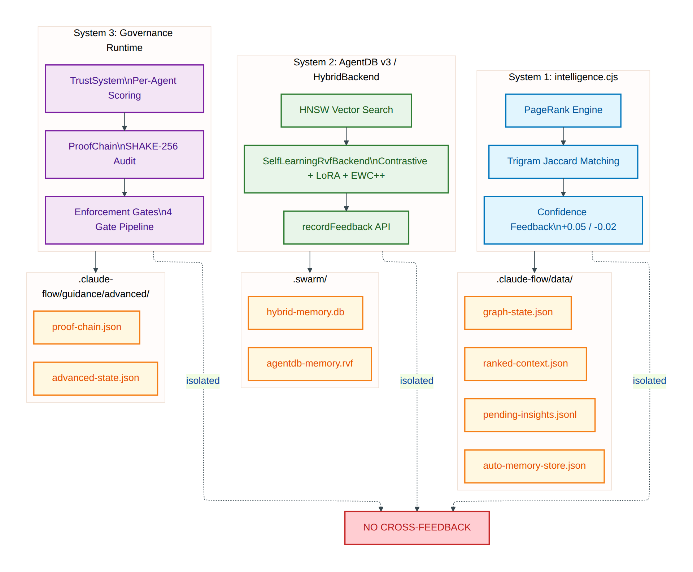

Mermaid Source

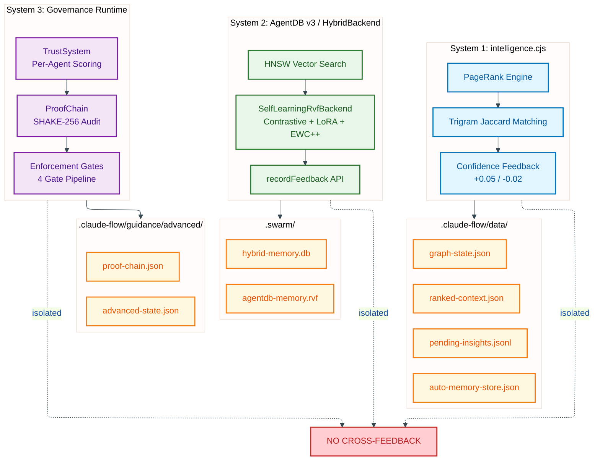
```mermaid
---
config:
  layout: elk
  elk:
    mergeEdges: false
    nodePlacementStrategy: BRANDES_KOEPF
---
%%{init: {
  "theme": "base",
  "themeVariables": {
    "primaryColor": "#E3F2FD",
    "primaryTextColor": "#0D47A1",
    "primaryBorderColor": "#1565C0",
    "lineColor": "#37474F"
  }
}}%%
flowchart TB
    accTitle: Three Independent Memory Systems
    accDescr: Shows the three learning systems and their isolation from each other

    classDef sys1 fill:#E1F5FE,stroke:#0277BD,stroke-width:2px,color:#01579B
    classDef sys2 fill:#E8F5E9,stroke:#2E7D32,stroke-width:2px,color:#1B5E20
    classDef sys3 fill:#F3E5F5,stroke:#7B1FA2,stroke-width:2px,color:#4A148C
    classDef data fill:#FFF8E1,stroke:#F57F17,stroke-width:2px,color:#E65100
    classDef warn fill:#FFCDD2,stroke:#C62828,stroke-width:2px,color:#B71C1C

    subgraph S1["System 1: intelligence.cjs"]
        direction TB
        I1["PageRank Engine"]:::sys1
        I2["Trigram Jaccard Matching"]:::sys1
        I3["Confidence Feedback<br/>+0.05 / -0.02"]:::sys1
        I1 --> I2 --> I3
    end

    subgraph S2["System 2: AgentDB v3 / HybridBackend"]
        direction TB
        A1["HNSW Vector Search"]:::sys2
        A2["SelfLearningRvfBackend<br/>Contrastive + LoRA + EWC++"]:::sys2
        A3["recordFeedback API"]:::sys2
        A1 --> A2 --> A3
    end

    subgraph S3["System 3: Governance Runtime"]
        direction TB
        G1["TrustSystem<br/>Per-Agent Scoring"]:::sys3
        G2["ProofChain<br/>SHAKE-256 Audit"]:::sys3
        G3["Enforcement Gates<br/>4 Gate Pipeline"]:::sys3
        G1 --> G2 --> G3
    end

    subgraph D1[".claude-flow/data/"]
        direction TB
        D1a["auto-memory-store.json"]:::data
        D1b["graph-state.json"]:::data
        D1c["ranked-context.json"]:::data
        D1d["pending-insights.jsonl"]:::data
    end

    subgraph D2[".swarm/"]
        direction TB
        D2a["agentdb-memory.rvf"]:::data
        D2b["hybrid-memory.db"]:::data
    end

    subgraph D3[".claude-flow/guidance/advanced/"]
        direction TB
        D3a["advanced-state.json"]:::data
        D3b["proof-chain.json"]:::data
    end

    S1 --> D1
    S2 --> D2
    S3 --> D3

    NO1["NO CROSS-FEEDBACK"]:::warn
    S1 -.->|"isolated"| NO1
    S2 -.->|"isolated"| NO1
    S3 -.->|"isolated"| NO1
```

---

## System 1: intelligence.cjs — PageRank Knowledge Graph

**Backend:** JSON files in `.claude-flow/data/`

**What it learns:** Entry confidence scores, PageRank rankings, auto-generated
"insight" entries for frequently-edited files (3+ edits per session).

**Used for:** Context injection into prompts — returns top-5 ranked patterns
via trigram Jaccard matching against the prompt.

| File | Format | Purpose |
|------|--------|---------|
| `auto-memory-store.json` | JSON array | Source entries (from MEMORY.md bootstrap or backend sync) |
| `graph-state.json` | JSON | Nodes + edges + PageRank scores |
| `ranked-context.json` | JSON | Pre-computed rankings for <15ms lookup |
| `pending-insights.jsonl` | JSONL (append) | Edit activity log, processed at session end |
| `intelligence-snapshot.json` | JSON array | Circular buffer of 50 snapshots for trend tracking |

### Learning Loop

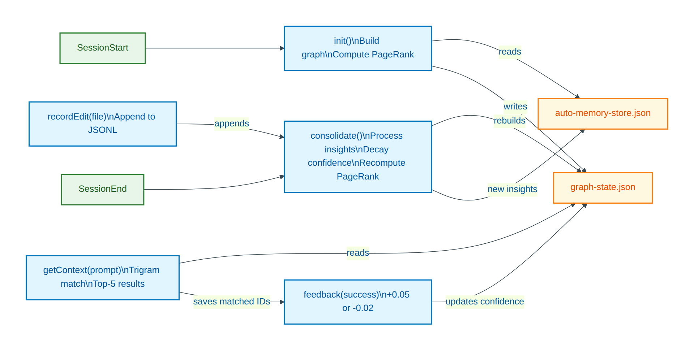

Mermaid Source

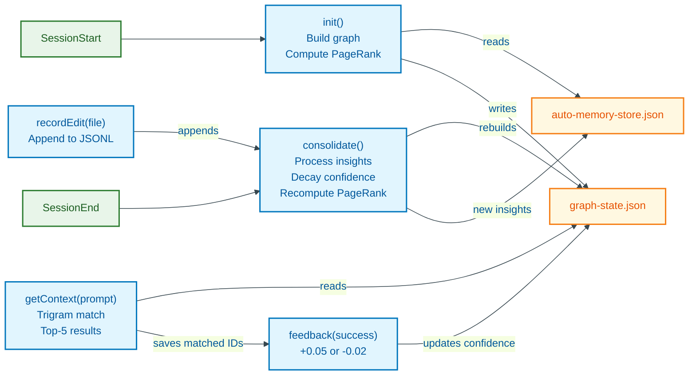
```mermaid
%%{init: {
  "theme": "base",
  "themeVariables": {
    "primaryColor": "#E1F5FE",
    "primaryTextColor": "#01579B",
    "primaryBorderColor": "#0277BD",
    "lineColor": "#37474F"
  }
}}%%
flowchart LR
    accTitle: System 1 Learning Loop
    accDescr: Shows the feedback cycle in intelligence.cjs from session start through consolidation

    classDef process fill:#E1F5FE,stroke:#0277BD,stroke-width:2px,color:#01579B
    classDef data fill:#FFF8E1,stroke:#F57F17,stroke-width:2px,color:#E65100
    classDef event fill:#E8F5E9,stroke:#2E7D32,stroke-width:2px,color:#1B5E20

    SS["SessionStart"]:::event
    INIT["init()<br/>Build graph<br/>Compute PageRank"]:::process
    CTX["getContext(prompt)<br/>Trigram match<br/>Top-5 results"]:::process
    REC["recordEdit(file)<br/>Append to JSONL"]:::process
    FB["feedback(success)<br/>+0.05 or -0.02"]:::process
    CON["consolidate()<br/>Process insights<br/>Decay confidence<br/>Recompute PageRank"]:::process
    SE["SessionEnd"]:::event
    STORE["auto-memory-store.json"]:::data
    GRAPH["graph-state.json"]:::data

    SS --> INIT
    INIT -->|"reads"| STORE
    INIT -->|"writes"| GRAPH
    CTX -->|"reads"| GRAPH
    CTX -->|"saves matched IDs"| FB
    REC -->|"appends"| CON
    FB -->|"updates confidence"| GRAPH
    CON -->|"rebuilds"| GRAPH
    CON -->|"new insights"| STORE
    SE --> CON
```

### Key Algorithms

- **PageRank:** Standard power iteration, damping=0.85, 30 iterations, dangling node redistribution
- **Similarity:** Trigram-based Jaccard (character 3-grams, not token-level)
- **Scoring:** `score = 0.6 * pageRank + 0.4 * confidence`
- **Confidence decay:** `conf -= decayRate * floor(hours_idle / 24)`, floored at 0.05

---

## System 2: AgentDB v3 / HybridBackend

**Backend:** SQLite (`.swarm/hybrid-memory.db`) + AgentDB RVF (`.swarm/agentdb-memory.rvf`)

**What it learns:** Contrastive training on positive/negative feedback pairs, LoRA
micro-adaptation, EWC++ consolidation to prevent catastrophic forgetting. All learning
happens inside AgentDB's Rust/WASM layer.

**Used for:** Vector search via MCP tools (`memory_store`, `memory_search`,
`memory_retrieve`), HNSW nearest-neighbor retrieval with 61us latency.

| File | Format | Purpose |
|------|--------|---------|
| `agentdb-memory.rvf` | AgentDB v3 RVF container | Unified vectors + relational + learning state + witness chain |
| `hybrid-memory.db` | SQLite (WAL mode) | Key-value entries with embeddings |

### Learning Loop

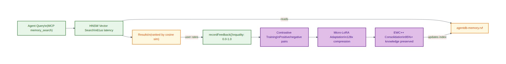

Mermaid Source

```mermaid
%%{init: {
  "theme": "base",
  "themeVariables": {
    "primaryColor": "#E8F5E9",
    "primaryTextColor": "#1B5E20",
    "primaryBorderColor": "#2E7D32",
    "lineColor": "#37474F"
  }
}}%%
flowchart LR
    accTitle: System 2 Learning Loop
    accDescr: Shows AgentDB self-learning pipeline from query through contrastive training

    classDef process fill:#E8F5E9,stroke:#2E7D32,stroke-width:2px,color:#1B5E20
    classDef data fill:#FFF8E1,stroke:#F57F17,stroke-width:2px,color:#E65100
    classDef learn fill:#E1BEE7,stroke:#6A1B9A,stroke-width:2px,color:#4A148C

    Q["Agent Query<br/>(MCP memory_search)"]:::process
    HNSW["HNSW Vector Search<br/>61us latency"]:::process
    RES["Results<br/>(ranked by cosine sim)"]:::data
    FB["recordFeedback()<br/>quality: 0.0-1.0"]:::process
    CT["Contrastive Training<br/>Positive/negative pairs"]:::learn
    LORA["Micro-LoRA Adaptation<br/>128x compression"]:::learn
    EWC["EWC++ Consolidation<br/>95%+ knowledge preserved"]:::learn
    RVF["agentdb-memory.rvf"]:::data

    Q --> HNSW
    HNSW -->|"reads"| RVF
    HNSW --> RES
    RES -->|"user rates"| FB
    FB --> CT
    CT --> LORA
    LORA --> EWC
    EWC -->|"updates index"| RVF
```

### Key Capabilities

- **Search:** HNSW nearest-neighbor, hybrid BM25+vector via Reciprocal Rank Fusion
- **Learning:** SelfLearningRvfBackend — contrastive pairs, LoRA adapters, EWC++ consolidation
- **Audit:** SHAKE-256 witness chain for tamper detection
- **Branching:** COW branching for instant experimentation without duplication

---

## System 3: Governance Runtime

**Backend:** JSON files in `.claude-flow/guidance/advanced/`

**What it learns:** Per-agent trust scores (accumulation + decay), threat signal
patterns, conformance violation history.

**Used for:** Enforcement gates, cryptographic audit trail, collusion detection,
rule evolution pipeline. This is NOT memory in the agent-knowledge sense — it's
a governance/compliance layer.

| Subsystem | Purpose |
|-----------|---------|
| **TrustSystem** | Per-agent reputation scoring with privilege tiers |
| **ProofChain** | Hash-chained cryptographic envelopes (HMAC-SHA256) |
| **ThreatDetector** | Prompt injection, memory poisoning, exfiltration detection |
| **CollusionDetector** | Ring topology analysis (min 3 agents, frequency threshold 5) |
| **MemoryQuorum** | 2/3 voting consensus for critical memory operations |
| **EvolutionPipeline** | Propose > simulate > staged rollout with auto-rollback |
| **ConformanceRunner** | Memory Clerk acceptance testing |

### Governance Pipeline

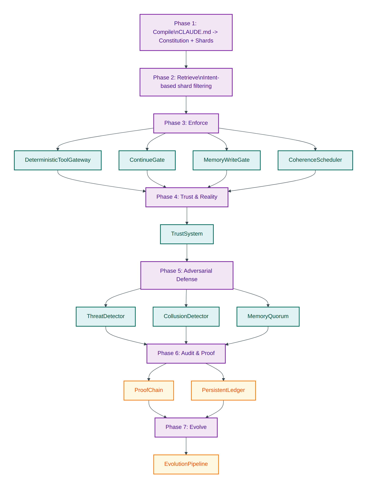

Mermaid Source

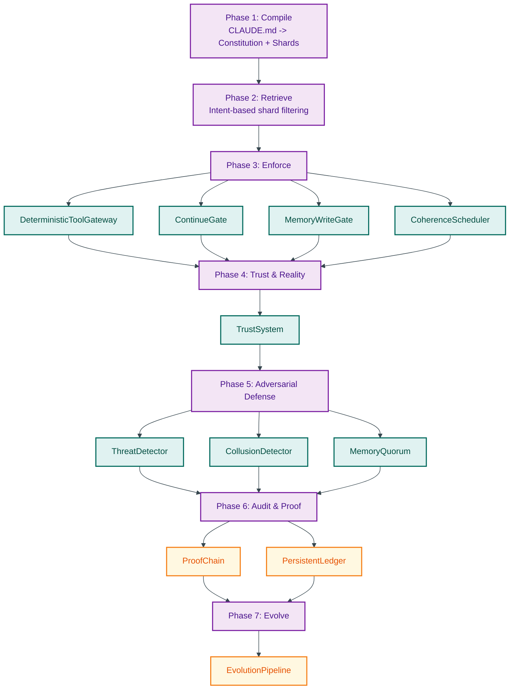
```mermaid
%%{init: {
  "theme": "base",
  "themeVariables": {
    "primaryColor": "#F3E5F5",
    "primaryTextColor": "#4A148C",
    "primaryBorderColor": "#7B1FA2",
    "lineColor": "#37474F"
  }
}}%%
flowchart TB
    accTitle: System 3 Governance Pipeline
    accDescr: Shows the 7-phase governance pipeline from compilation through evolution

    classDef phase fill:#F3E5F5,stroke:#7B1FA2,stroke-width:2px,color:#4A148C
    classDef gate fill:#E0F2F1,stroke:#00695C,stroke-width:2px,color:#004D40
    classDef audit fill:#FFF8E1,stroke:#F57F17,stroke-width:2px,color:#E65100

    P1["Phase 1: Compile<br/>CLAUDE.md -> Constitution + Shards"]:::phase
    P2["Phase 2: Retrieve<br/>Intent-based shard filtering"]:::phase
    P3["Phase 3: Enforce"]:::phase
    P4["Phase 4: Trust & Reality"]:::phase
    P5["Phase 5: Adversarial Defense"]:::phase
    P6["Phase 6: Audit & Proof"]:::phase
    P7["Phase 7: Evolve"]:::phase

    G1["DeterministicToolGateway"]:::gate
    G2["ContinueGate"]:::gate
    G3["MemoryWriteGate"]:::gate
    G4["CoherenceScheduler"]:::gate

    T1["TrustSystem"]:::gate
    T2["ThreatDetector"]:::gate
    T3["CollusionDetector"]:::gate
    T4["MemoryQuorum"]:::gate

    A1["ProofChain"]:::audit
    A2["PersistentLedger"]:::audit

    E1["EvolutionPipeline"]:::audit

    P1 --> P2 --> P3
    P3 --> G1 & G2 & G3 & G4
    G1 & G2 & G3 & G4 --> P4
    P4 --> T1
    T1 --> P5
    P5 --> T2 & T3 & T4
    T2 & T3 & T4 --> P6
    P6 --> A1 & A2
    A1 & A2 --> P7
    P7 --> E1
```

---

## The Overlap

Systems 1 and 2 implement the **same concepts** with different backends:

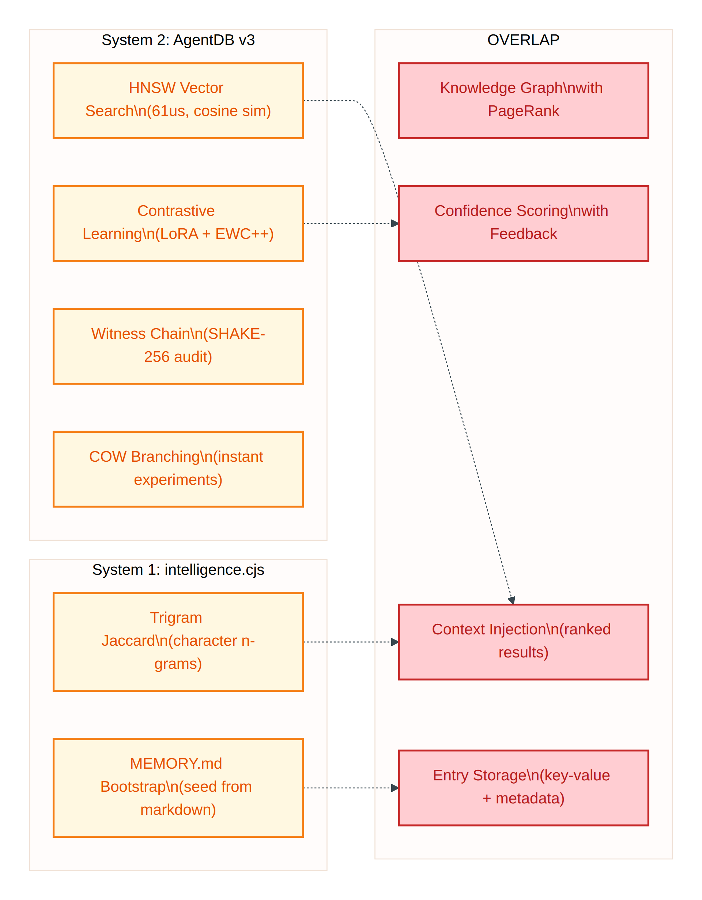

Mermaid Source

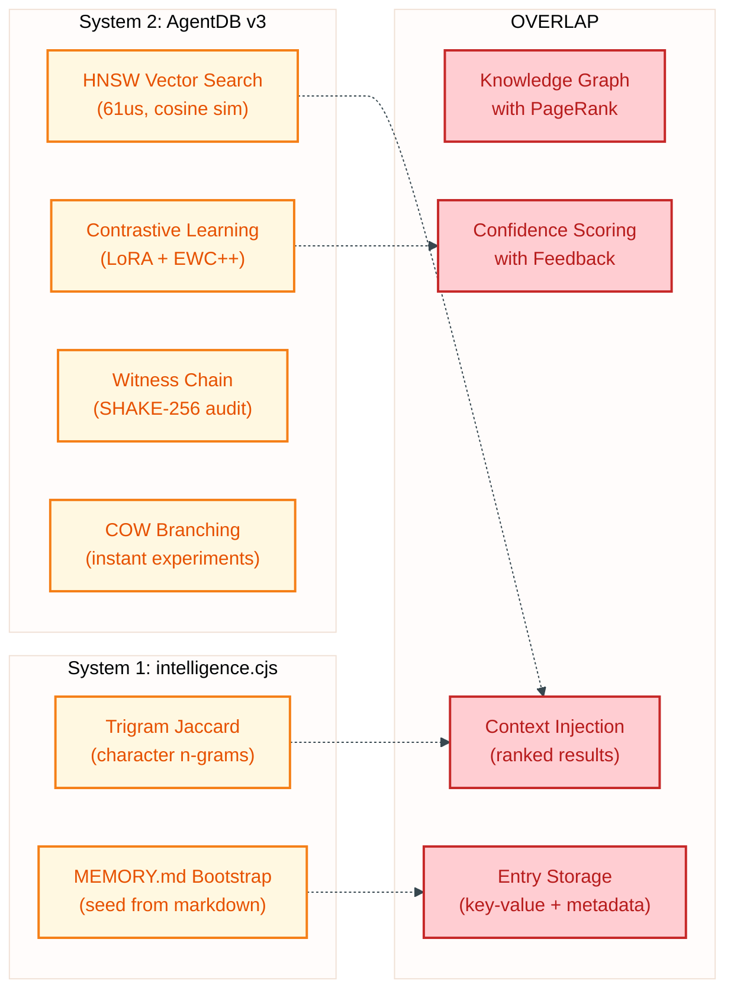
```mermaid
%%{init: {
  "theme": "base",
  "themeVariables": {
    "primaryColor": "#E3F2FD",
    "primaryTextColor": "#0D47A1",
    "primaryBorderColor": "#1565C0",
    "lineColor": "#37474F"
  }
}}%%
flowchart LR
    accTitle: System 1 vs System 2 Overlap
    accDescr: Shows which capabilities overlap between intelligence.cjs and AgentDB

    classDef sys1 fill:#E1F5FE,stroke:#0277BD,stroke-width:2px,color:#01579B
    classDef sys2 fill:#E8F5E9,stroke:#2E7D32,stroke-width:2px,color:#1B5E20
    classDef overlap fill:#FFCDD2,stroke:#C62828,stroke-width:2px,color:#B71C1C
    classDef unique fill:#FFF8E1,stroke:#F57F17,stroke-width:2px,color:#E65100

    subgraph LEFT["System 1: intelligence.cjs"]
        L1["Trigram Jaccard<br/>(character n-grams)"]:::unique
        L2["MEMORY.md Bootstrap<br/>(seed from markdown)"]:::unique
    end

    subgraph CENTER["OVERLAP"]
        C1["Knowledge Graph<br/>with PageRank"]:::overlap
        C2["Confidence Scoring<br/>with Feedback"]:::overlap
        C3["Entry Storage<br/>(key-value + metadata)"]:::overlap
        C4["Context Injection<br/>(ranked results)"]:::overlap
    end

    subgraph RIGHT["System 2: AgentDB v3"]
        R1["HNSW Vector Search<br/>(61us, cosine sim)"]:::unique
        R2["Contrastive Learning<br/>(LoRA + EWC++)"]:::unique
        R3["Witness Chain<br/>(SHAKE-256 audit)"]:::unique
        R4["COW Branching<br/>(instant experiments)"]:::unique
    end

    L1 -.-> C4
    L2 -.-> C3
    R1 -.-> C4
    R2 -.-> C2
```

### Comparison Table

| Concept | System 1 (intelligence.cjs) | System 2 (AgentDB v3) |
|---------|---------------------------|----------------------|
| **Search algorithm** | Trigram Jaccard (character 3-grams) | HNSW vector search (cosine similarity) |
| **Knowledge graph** | Custom PageRank (JSON) | MemoryGraph (same algorithm, in-process) |
| **Confidence scoring** | +0.05 / -0.02 per feedback | Contrastive training + LoRA adaptation |
| **Entry storage** | `auto-memory-store.json` (JSON array) | `.rvf` container (vectors + relational) |
| **Context injection** | Hook stdout (top-5 patterns) | MCP tools (agent calls explicitly) |
| **Learning speed** | Instant (JSON write) | Background (batch contrastive training) |
| **Search quality** | Low (no semantic understanding) | High (vector similarity + self-learning) |
| **Dependencies** | Zero (pure Node.js) | AgentDB v3 (sql.js WASM, 4.4MB) |

---

## Bridging the Gap: EmbeddingProvider and MemoryWriteGateHook

While the three systems historically operated in complete isolation, the guidance
implementation kit has delivered the first concrete components that bridge them:

### EmbeddingProvider Bridge

EmbeddingProvider creates a **shared vector space** used by both the ShardRetriever
(for task-to-shard matching) and the MemoryWriteGateHook (for semantic contradiction
detection). Two implementations are provided:

| Implementation | Backend | Use Case |
|----------------|---------|----------|
| `HashEmbeddingProvider` | Deterministic hash-based vectors | Zero dependencies, test-friendly, fast |
| `AgentDBEmbeddingProvider` | AgentDB v3 HNSW index | Real semantic search, production quality |

By providing a common embedding interface, the EmbeddingProvider bridge allows the
governance layer (System 3) to perform semantic operations against the same vector space
used by the memory layer (System 2). This is the first point of integration between
previously isolated systems.

### MemoryWriteGateHook

MemoryWriteGateHook protects memory integrity with a **4-check pipeline** that sits
between write requests and the memory store:

1. **Authority validation** -- Role + namespace checks ensure agents can only write to
   namespaces they own or have explicit access to.
2. **Rate limiting** -- Per-agent writes/min caps prevent flooding. Limits vary by
   trust tier (trusted agents get higher limits).
3. **Pattern contradiction** -- Keyword opposition detection catches obvious conflicts
   (e.g., writing "always use tabs" when "never use tabs" exists). Detects opposition
   pairs: always/never, enable/disable, require/forbid.
4. **Semantic contradiction** -- Uses EmbeddingProvider to compute cosine similarity
   (threshold >= 0.85) combined with opposition pair matching to detect entries that
   semantically contradict existing memory.

This gate bridges all three systems: it consumes **trust scores from System 3** to
set rate limits, queries **embeddings via System 2** (through EmbeddingProvider) for
semantic checks, and protects the **knowledge store used by System 1** from
contradictory writes.

---

## Current Architecture (Broken)

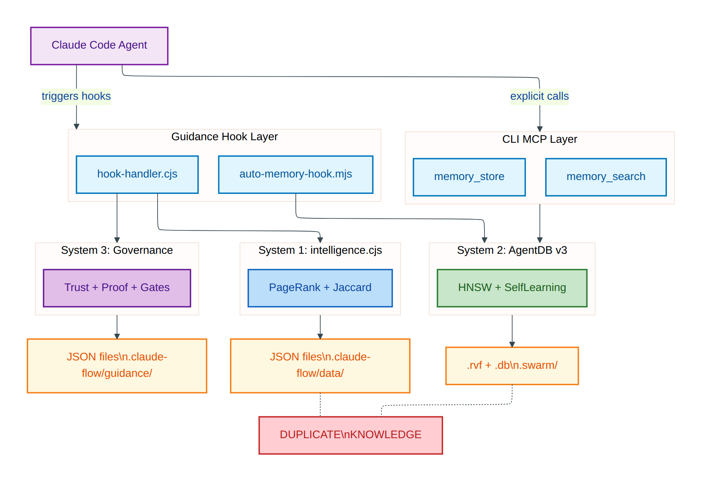

Mermaid Source

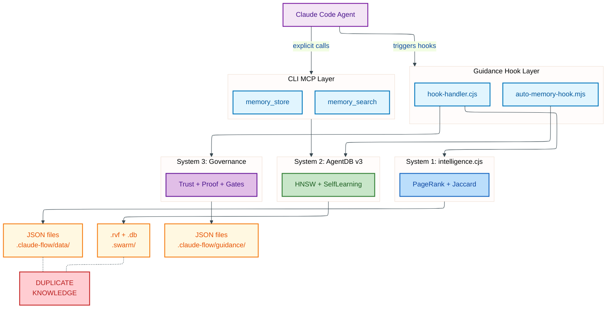
```mermaid
---
config:
  layout: elk
  elk:
    mergeEdges: false
    nodePlacementStrategy: BRANDES_KOEPF
---
%%{init: {
  "theme": "base",
  "themeVariables": {
    "primaryColor": "#E3F2FD",
    "primaryTextColor": "#0D47A1",
    "primaryBorderColor": "#1565C0",
    "lineColor": "#37474F"
  }
}}%%
flowchart TB
    accTitle: Current Architecture - Broken
    accDescr: Shows the current state where three systems operate independently with no integration

    classDef agent fill:#F3E5F5,stroke:#7B1FA2,stroke-width:2px,color:#4A148C
    classDef hook fill:#E1F5FE,stroke:#0277BD,stroke-width:2px,color:#01579B
    classDef sys1 fill:#BBDEFB,stroke:#1565C0,stroke-width:2px,color:#0D47A1
    classDef sys2 fill:#C8E6C9,stroke:#2E7D32,stroke-width:2px,color:#1B5E20
    classDef sys3 fill:#E1BEE7,stroke:#6A1B9A,stroke-width:2px,color:#4A148C
    classDef data fill:#FFF8E1,stroke:#F57F17,stroke-width:2px,color:#E65100
    classDef warn fill:#FFCDD2,stroke:#C62828,stroke-width:2px,color:#B71C1C

    AGENT["Claude Code Agent"]:::agent

    subgraph HOOKS["Guidance Hook Layer"]
        HH["hook-handler.cjs"]:::hook
        AMH["auto-memory-hook.mjs"]:::hook
    end

    subgraph MCP["CLI MCP Layer"]
        MS["memory_store"]:::hook
        MR["memory_search"]:::hook
    end

    subgraph SYS1["System 1: intelligence.cjs"]
        PR["PageRank + Jaccard"]:::sys1
    end

    subgraph SYS2["System 2: AgentDB v3"]
        ADB["HNSW + SelfLearning"]:::sys2
    end

    subgraph SYS3["System 3: Governance"]
        GOV["Trust + Proof + Gates"]:::sys3
    end

    D1["JSON files<br/>.claude-flow/data/"]:::data
    D2[".rvf + .db<br/>.swarm/"]:::data
    D3["JSON files<br/>.claude-flow/guidance/"]:::data

    AGENT -->|"explicit calls"| MCP
    AGENT -->|"triggers hooks"| HOOKS
    HH --> SYS1
    AMH --> SYS2
    HH --> SYS3
    MCP --> SYS2

    SYS1 --> D1
    SYS2 --> D2
    SYS3 --> D3

    X1["DUPLICATE<br/>KNOWLEDGE"]:::warn
    D1 -..- X1
    D2 -..- X1
```

### What's Wrong

1. **Duplicate storage:** Same knowledge entries stored as JSON array (System 1)
   AND as vector embeddings (System 2). No synchronization.
2. **Duplicate learning:** System 1 does `+0.05/-0.02` confidence adjustments.
   System 2 does contrastive training. Neither feeds into the other.
3. **Duplicate graph:** System 1 builds PageRank on JSON. The CLI's MemoryGraph
   (config.json `memory.memoryGraph.*`) does the same computation in-process.
4. **No trust gating:** System 3's trust scores don't influence System 1's routing
   or System 2's search ranking. *(Partially addressed: MemoryWriteGateHook now uses
   trust tiers for write rate limiting, and EmbeddingProvider enables semantic checks
   across system boundaries.)*

---

## Target Architecture (Unified)

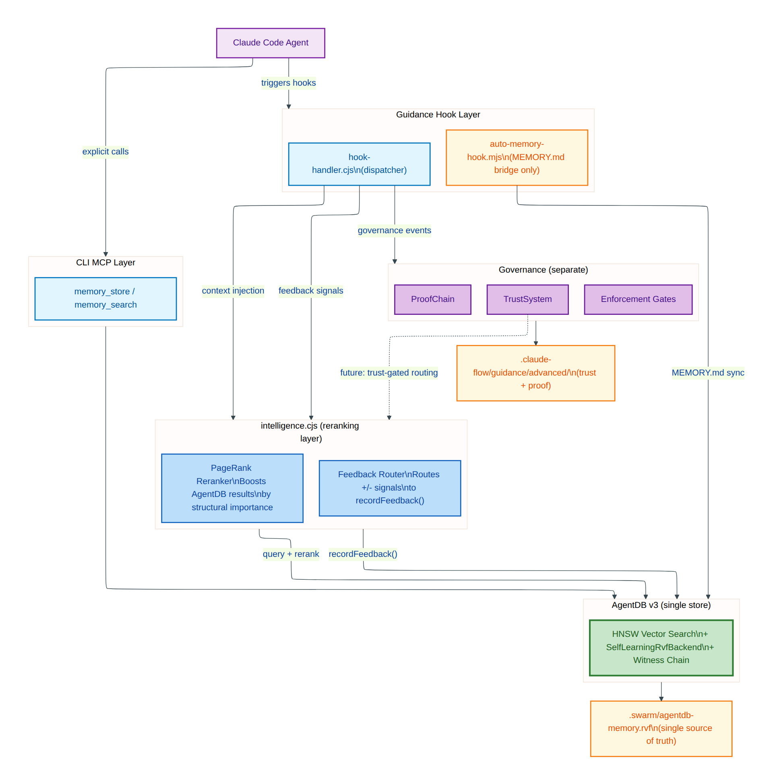

Mermaid Source

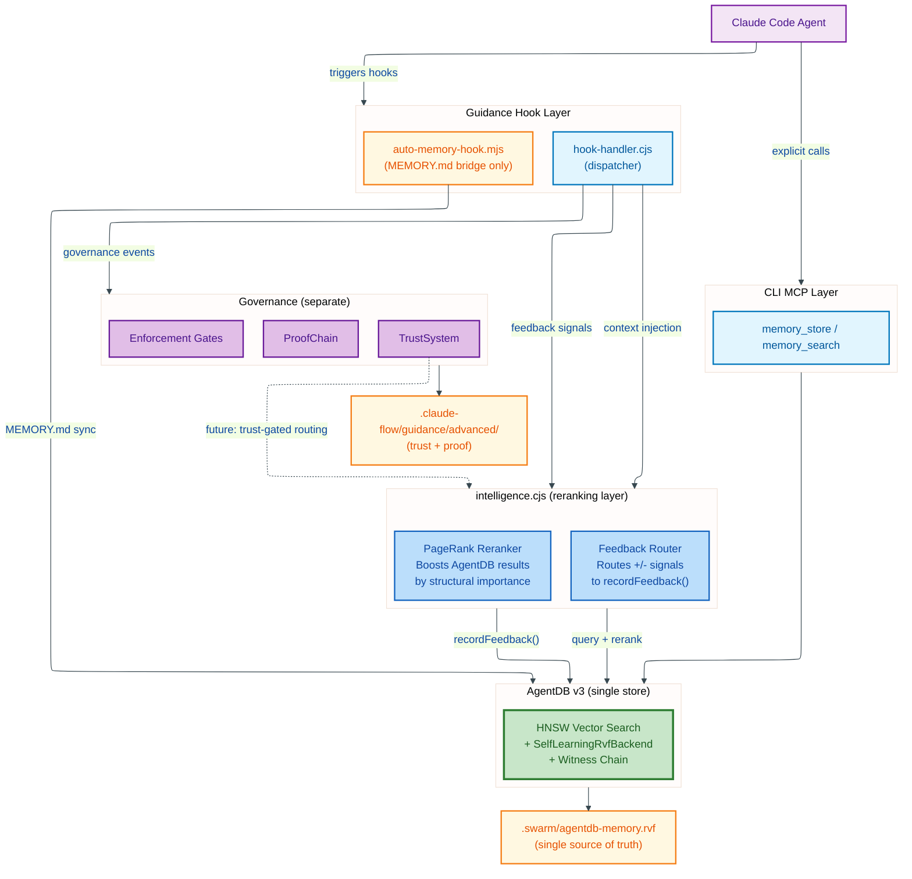
```mermaid
---
config:
  layout: elk
  elk:
    mergeEdges: false
    nodePlacementStrategy: BRANDES_KOEPF
---
%%{init: {
  "theme": "base",
  "themeVariables": {
    "primaryColor": "#E3F2FD",
    "primaryTextColor": "#0D47A1",
    "primaryBorderColor": "#1565C0",
    "lineColor": "#37474F"
  }
}}%%
flowchart TB
    accTitle: Target Architecture - Unified
    accDescr: Shows the recommended architecture with AgentDB as single store and intelligence as reranking layer

    classDef agent fill:#F3E5F5,stroke:#7B1FA2,stroke-width:2px,color:#4A148C
    classDef hook fill:#E1F5FE,stroke:#0277BD,stroke-width:2px,color:#01579B
    classDef store fill:#C8E6C9,stroke:#2E7D32,stroke-width:3px,color:#1B5E20
    classDef rerank fill:#BBDEFB,stroke:#1565C0,stroke-width:2px,color:#0D47A1
    classDef gov fill:#E1BEE7,stroke:#6A1B9A,stroke-width:2px,color:#4A148C
    classDef bridge fill:#FFF8E1,stroke:#F57F17,stroke-width:2px,color:#E65100
    classDef data fill:#FFF8E1,stroke:#F57F17,stroke-width:2px,color:#E65100

    AGENT["Claude Code Agent"]:::agent

    subgraph HOOKS["Guidance Hook Layer"]
        HH["hook-handler.cjs<br/>(dispatcher)"]:::hook
        AMH["auto-memory-hook.mjs<br/>(MEMORY.md bridge only)"]:::bridge
    end

    subgraph MCP["CLI MCP Layer"]
        MS["memory_store / memory_search"]:::hook
    end

    subgraph RERANK["intelligence.cjs (reranking layer)"]
        PR["PageRank Reranker<br/>Boosts AgentDB results<br/>by structural importance"]:::rerank
        FB["Feedback Router<br/>Routes +/- signals<br/>to recordFeedback()"]:::rerank
    end

    subgraph SINGLE["AgentDB v3 (single store)"]
        ADB["HNSW Vector Search<br/>+ SelfLearningRvfBackend<br/>+ Witness Chain"]:::store
    end

    subgraph GOV["Governance (separate)"]
        TRUST["TrustSystem"]:::gov
        PROOF["ProofChain"]:::gov
        GATES["Enforcement Gates"]:::gov
    end

    RVF[".swarm/agentdb-memory.rvf<br/>(single source of truth)"]:::data
    GOV_DATA[".claude-flow/guidance/advanced/<br/>(trust + proof)"]:::data

    AGENT -->|"explicit calls"| MCP
    AGENT -->|"triggers hooks"| HOOKS
    HH -->|"context injection"| RERANK
    HH -->|"feedback signals"| RERANK
    HH -->|"governance events"| GOV
    AMH -->|"MEMORY.md sync"| SINGLE
    MCP --> SINGLE
    RERANK -->|"query + rerank"| SINGLE
    RERANK -->|"recordFeedback()"| SINGLE

    SINGLE --> RVF
    GOV --> GOV_DATA

    TRUST -.->|"future: trust-gated routing"| RERANK
```

### What Changes

| Component | Current | Target |
|-----------|---------|--------|
| **intelligence.cjs** | Reads JSON files, builds own graph | Queries AgentDB, reranks results with PageRank |
| **memory.cjs** | JSON key-value store | **Deprecated** — use AgentDB namespaces |
| **auto-memory-hook.mjs** | JSON store + optional HybridBackend | MEMORY.md <-> AgentDB bridge only |
| **session.cjs** | JSON session lifecycle | **Keep as-is** (ephemeral, not memory) |
| **Governance runtime** | Isolated JSON files | **Keep as-is** + future trust-gated routing |
| **Feedback path** | `+0.05/-0.02` on JSON | `recordFeedback()` on AgentDB (contrastive learning) |
| **Data files** | 5 JSON files in `.claude-flow/data/` | 1 RVF file in `.swarm/` |

---

## Session Lifecycle (Target)

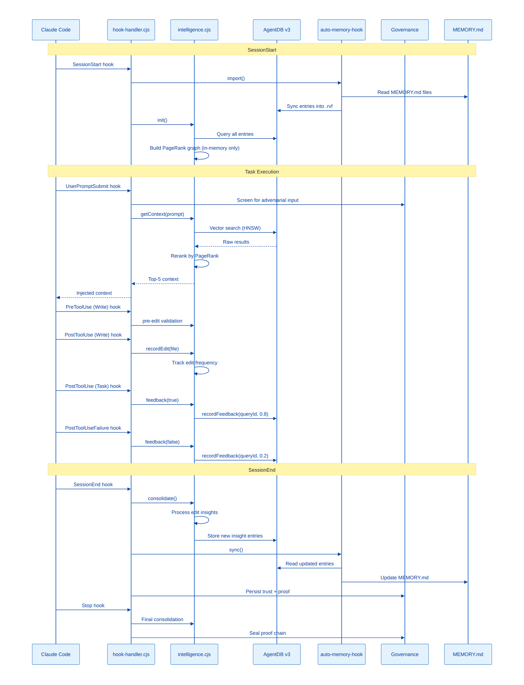

Mermaid Source

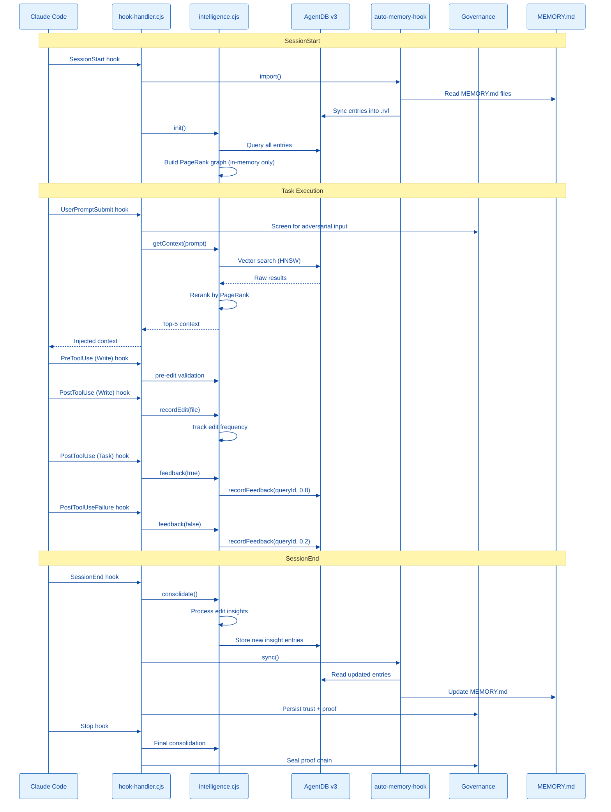
```mermaid
%%{init: {
  "theme": "base",
  "themeVariables": {
    "primaryColor": "#E3F2FD",
    "primaryTextColor": "#0D47A1",
    "primaryBorderColor": "#1565C0",
    "lineColor": "#37474F"
  }
}}%%
sequenceDiagram
    accTitle: Target Session Lifecycle
    accDescr: Shows the unified data flow from session start through task execution to session end

    participant CC as Claude Code
    participant HH as hook-handler.cjs
    participant INT as intelligence.cjs
    participant ADB as AgentDB v3
    participant AMH as auto-memory-hook
    participant GOV as Governance
    participant MEM as MEMORY.md

    Note over CC,MEM: SessionStart

    CC->>HH: SessionStart hook
    HH->>AMH: import()
    AMH->>MEM: Read MEMORY.md files
    AMH->>ADB: Sync entries into .rvf
    HH->>INT: init()
    INT->>ADB: Query all entries
    INT->>INT: Build PageRank graph (in-memory only)

    Note over CC,MEM: Task Execution

    CC->>HH: UserPromptSubmit hook
    HH->>GOV: Screen for adversarial input
    HH->>INT: getContext(prompt)
    INT->>ADB: Vector search (HNSW)
    ADB-->>INT: Raw results
    INT->>INT: Rerank by PageRank
    INT-->>HH: Top-5 context
    HH-->>CC: Injected context

    CC->>HH: PreToolUse (Write) hook
    HH->>INT: pre-edit validation

    CC->>HH: PostToolUse (Write) hook
    HH->>INT: recordEdit(file)
    INT->>INT: Track edit frequency

    CC->>HH: PostToolUse (Task) hook
    HH->>INT: feedback(true)
    INT->>ADB: recordFeedback(queryId, 0.8)

    CC->>HH: PostToolUseFailure hook
    HH->>INT: feedback(false)
    INT->>ADB: recordFeedback(queryId, 0.2)

    Note over CC,MEM: SessionEnd

    CC->>HH: SessionEnd hook
    HH->>INT: consolidate()
    INT->>INT: Process edit insights
    INT->>ADB: Store new insight entries
    HH->>AMH: sync()
    AMH->>ADB: Read updated entries
    AMH->>MEM: Update MEMORY.md
    HH->>GOV: Persist trust + proof

    CC->>HH: Stop hook
    HH->>INT: Final consolidation
    HH->>GOV: Seal proof chain
```

---

## Migration Path

### Phase 1: AgentDB as Primary Store (WM-008) -- COMPLETE
- ~~Upgrade agentdb v2 -> v3 in `@claude-flow/memory`~~ -- **Done** (WM-008)
- ~~Wire `SelfLearningRvfBackend` into `agentdb-backend.js`~~ -- **Done** (WM-008)
- ~~Change storage path: `.db` -> `.rvf`~~ -- **Done** (WM-008)
- ~~Add `recordFeedback()` API to backend~~ -- **Done** (WM-009 + WM-012)

### Phase 2: intelligence.cjs Reads from AgentDB
- Replace `readJSON(STORE_PATH)` with AgentDB `query()` calls
- Keep PageRank computation but build graph from AgentDB entries
- Stop writing `auto-memory-store.json` (AgentDB is the store)
- Route `feedback()` calls to `AgentDB.recordFeedback()`

### Phase 3: Deprecate Parallel Stores
- Remove `memory.cjs` (use AgentDB namespaces)
- Remove `auto-memory-store.json` (AgentDB is source of truth)
- Simplify `auto-memory-hook.mjs` to MEMORY.md <-> AgentDB bridge only
- Keep `graph-state.json` as optional cache (rebuilt from AgentDB on init)

### Phase 4: Trust-Gated Routing (Partially Complete)
- ~~Wire trust scores into memory write path~~ -- **Done:** MemoryWriteGateHook uses trust tiers for rate limiting
- ~~Create shared embedding interface~~ -- **Done:** EmbeddingProvider with hash and AgentDB implementations
- Make MemoryWriteGateHook mandatory in `memory_store` write path -- **Planned** (see alignment analysis R1)
- Wire trust scores into search result ranking -- **Planned** (see alignment analysis R2)
- Wire `TrustSystem.getScore(agentId)` into `router.cjs` for task routing
- Gate task routing by agent trust tier
- Feed routing outcomes back into TrustSystem

---

## Appendix: Data File Inventory

| File | System | Location | Fate |
|------|--------|----------|------|
| `auto-memory-store.json` | 1 | `.claude-flow/data/` | **Remove** (AgentDB replaces) |
| `graph-state.json` | 1 | `.claude-flow/data/` | **Keep as cache** (rebuilt from AgentDB) |
| `ranked-context.json` | 1 | `.claude-flow/data/` | **Keep as cache** (rebuilt from AgentDB) |
| `pending-insights.jsonl` | 1 | `.claude-flow/data/` | **Keep** (local edit log, processed at consolidation) |
| `intelligence-snapshot.json` | 1 | `.claude-flow/data/` | **Keep** (trend tracking, not redundant) |
| `memory.json` | 1 | `.claude-flow/data/` | **Remove** (AgentDB namespaces replace) |
| `current.json` | 1 | `.claude-flow/sessions/` | **Keep** (session lifecycle, not memory) |
| `agentdb-memory.rvf` | 2 | `.swarm/` | **Keep** (single source of truth) |
| `hybrid-memory.db` | 2 | `.swarm/` | **Keep** (SQLite adapter in HybridBackend) |
| `advanced-state.json` | 3 | `.claude-flow/guidance/advanced/` | **Keep** (governance, not memory) |
| `proof-chain.json` | 3 | `.claude-flow/guidance/advanced/` | **Keep** (governance, not memory) |
| `components.json` | 3 | `.claude-flow/guidance/` | **Keep** (feature flags) |

---

## Summary

The three memory/learning systems in the claude-flow ecosystem were designed and
deployed independently, resulting in duplicate storage, duplicate learning loops, and
zero cross-system feedback. The target architecture consolidates Systems 1 and 2
behind AgentDB v3 while keeping the governance layer (System 3) separate.

**EmbeddingProvider and MemoryWriteGateHook represent the first concrete bridge between
the previously isolated systems.** EmbeddingProvider establishes a shared vector space
that both the policy retriever and the memory gate can use, while MemoryWriteGateHook
enforces write integrity using trust scores from the governance layer and semantic
embeddings from the memory layer. Together, they demonstrate that the three systems can
interoperate without requiring a full merge -- validating the incremental migration
strategy outlined in the Migration Path above.

---

## Related Documents

| Document | Repo | Contents |
|----------|------|----------|
| [Guidance Memory Alignment Analysis](../../../worktree/claude-flow-patch-agentdb-upgrade/docs/guidance-memory-alignment.md) | patch | Merge vs align decision, trust boundary, phased plan |
| [Memory System Architecture](../../../worktree/claude-flow-patch-agentdb-upgrade/docs/memory-system.md) | patch | CLI memory system: HybridBackend, session lifecycle, config |
| [Memory System Analysis](../../../worktree/claude-flow-patch-agentdb-upgrade/docs/memory-system-analysis.md) | patch | Overlap analysis with architecture diagrams |
